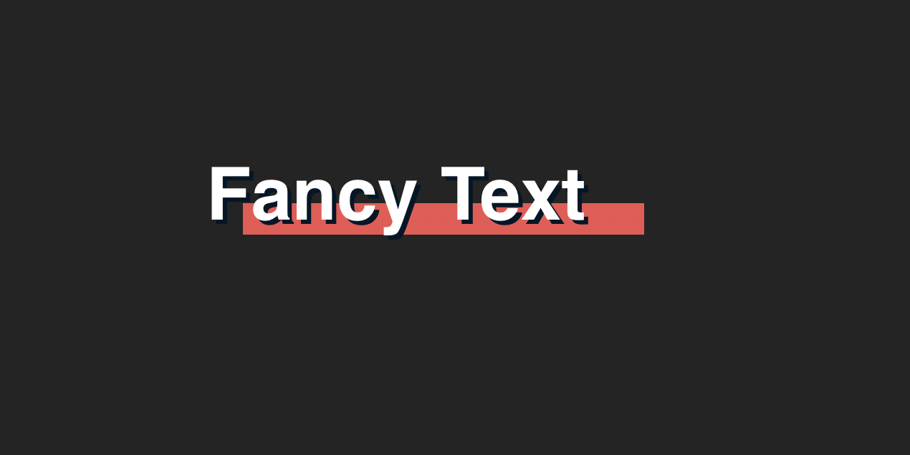

# Fancy Text
  

<a href="https://6430616c9dd94421cb7112ed-lzzpxdbcew.chromatic.com/?path=/story/component-fancytext--primary" target="_blank"></a>

React Fancy Texts is a UI library package that allows you to create fancy looking headings and texts easily in your React applications. The library provides a collection of pre-designed text styles that you can use right out of the box, or customize to your liking.

## Installation 
```
npm i @kuncheria_k/fancy-text
```

## Usage
Once you have installed the library, you can import and use the FancyText component like any other React component.
```jsx
import { FancyText } from '@kuncheria_k/fancy-text'

function App() {
  return (
    <FancyText text='Fancy Text'/>
  )
}
```
You can find more examples in this [storybook](https://6430616c9dd94421cb7112ed-lzzpxdbcew.chromatic.com/?path=/story/component-fancytext--primary) for the components. 

## Contributing
If you would like to contribute to React Fancy Texts, please feel free to submit a pull request. We welcome contributions of all kinds, including bug fixes, new features, and documentation improvements.

<a href="https://www.buymeacoffee.com/kuncheria" target="_blank"></a>
## License
React Fancy Texts is licensed under the MIT License. See LICENSE for more information.

